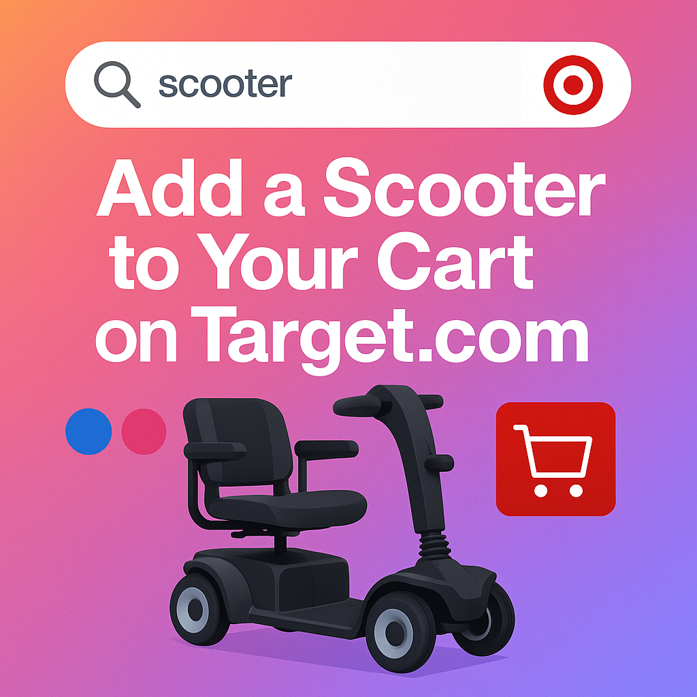

# Arcade Flow Analysis Report

**Flow Name:** Add a Scooter to Your Cart on Target.com  
**Analysis Date:** September 13, 2025 at 10:38 PM  
**Total Actions:** 11  

---

## 💼 Executive Summary

> The user flow analysis reveals a strong conversion potential with users demonstrating clear purchase intent and engagement with customization options, suggesting an opportunity to enhance product development and marketing strategies. However, the rejection of the extended coverage protection plan indicates a need to better communicate its value and benefits, and to ensure the checkout process is free from potential friction points that could deter purchase completion.

## 🔍 Detailed Analysis

1. **User Journey Analysis**: The user's primary goal was to add a specific scooter to their cart on Target.com, which they achieved effectively. The user demonstrated a clear intent from the beginning, initiating a product discovery with a specific search query. They moved from browsing to a product focus, made a customization choice, compared alternatives, and confirmed their purchase intent by adding the product to the cart. 

2. **Behavioral Insights**: The user's actions reveal a thoughtful decision-making process. They compared color options before finalizing their choice, indicating a preference for customization and a desire to explore alternatives. The rejection of the extended coverage protection plan suggests price sensitivity or a perceived lack of value in the additional coverage. 

3. **UX/UI Performance**: The interface design seems to have supported the user's goals effectively. The user was able to navigate the search function, product details, customization options, and cart addition without apparent difficulty. However, the offer of the extended coverage protection plan could be a potential friction point if it was perceived as an unnecessary upsell.

4. **Business Impact**: This flow indicates a strong conversion potential, as the user demonstrated clear purchase intent and successfully completed their goal. The user's engagement with customization options suggests an interest in personalized products, which could inform future product development or marketing strategies. The rejection of the additional coverage plan may indicate a need to better communicate its value or reconsider its pricing.

5. **Key Takeaways**: 
   - Consider improving the presentation of add-ons like the extended coverage protection plan to better communicate their value.
   - Explore ways to highlight customization options earlier in the user flow to engage users who value personalized products.
   - Monitor user interactions with the search function to ensure it effectively supports product discovery.
   - Review the checkout process to ensure it is streamlined and free of potential friction points that could deter purchase completion.

---

## 🎯 Flow Insights

- **Flow Classification:** Successful E-commerce Conversion with Product Customization
- **Completion Rate:** 100%

### 📊 Conversion Funnel
- **Search Initiated:** ✅
- **Product Selected:** ✅
- **Customization Explored:** ✅
- **Cart Conversion:** ✅
- **Flow Completed:** ✅

### 🧠 User Behavior Indicators  
- **Price Conscious:** ✅
- **Exploration Oriented:** ✅
- **Goal Oriented:** ✅

---

## 👤 User Interactions (Step-by-Step)

The following actions were performed by the user during this flow:

1. **Started tutorial: "Add a Scooter to Your Cart on Target.com"**

2. **Clicked on the search bar to start looking for products**
   - *Element:* search
   - *Page:* Target : Expect More. Pay Less.

3. **Typed "scooter" in the search bar**
   - *Element:* scooter
   - *Page:* Target : Expect More. Pay Less.

4. **Clicked on the "Razor A5 Lux 2 Wheel Kick Scooter" to view product details**
   - *Element:* Razor A5 Lux 2 Wheel Kick Scooter
   - *Page:* "scooter" : Target

5. **Selected "Blue" color option**
   - *Element:* Blue
   - *Page:* Razor A5 Lux Kick Scooter - Cherry Red: Steel Frame, Urethane Wheels, 220 lb Capacity : Target

6. **Explored "Pink" color option**
   - *Element:* Pink
   - *Page:* Razor A5 Lux Kick Scooter - Cherry Red: Steel Frame, Urethane Wheels, 220 lb Capacity : Target

7. **Clicked "Add to cart" to add the scooter to shopping cart**
   - *Element:* Add to cart
   - *Page:* Razor A5 Lux Kick Scooter - Cherry Red: Steel Frame, Urethane Wheels, 220 lb Capacity : Target

8. **Declined the extended coverage protection plan**
   - *Element:* Decline coverage
   - *Page:* Razor A5 Lux Kick Scooter - Cherry Red: Steel Frame, Urethane Wheels, 220 lb Capacity : Target

9. **Clicked on the cart icon to review selected items**
   - *Element:* 1
   - *Page:* Razor A5 Lux Kick Scooter - Cherry Red: Steel Frame, Urethane Wheels, 220 lb Capacity : Target

10. **Performed an action on the page**
   - *Page:* Cart : Target

11. **Completed the tutorial: "Thank you for your interest!"**

### Action Breakdown

- **Start:** 1
- **Search:** 1
- **Type:** 1
- **Select Product:** 1
- **Select Option:** 1
- **Browse Options:** 1
- **Add To Cart:** 1
- **Decline Option:** 1
- **Navigate Cart:** 1
- **Action:** 1
- **Complete:** 1

---

## 🎨 Social Media Image

*Generated social media image optimized for sharing across platforms*

---

## 🔧 Technical Details

- **Analysis Tool:** Arcade Flow Analyzer
- **AI Models Used:** GPT-4 (summary), GPT-Image-1 (image generation)
- **Source Data:** flow.json
- **Generated Files:**
  - Report: `flow_analysis_report_Add_a_Scooter_to_Your_Cart_on_Targetcom_20250913_223750.md`
  - Image: `social_media_1757828324.png`

---

*This report was automatically generated by the Arcade Flow Analyzer.*
