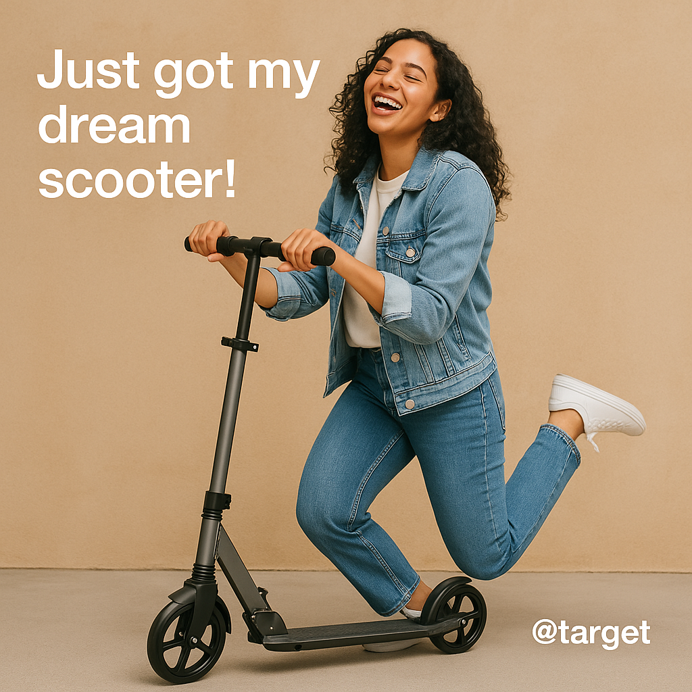

# Arcade Flow Analysis Report

**Flow Name:** Add a Scooter to Your Cart on Target.com  
**Analysis Date:** September 14, 2025 at 01:56 PM  
**Total Actions:** 11  

---

## Executive Summary

> Users with clear purchase intent experience a smooth and efficient path to adding scooters to their cart on Target.com, driving strong conversion potential; however, low uptake of add-on offers highlights an opportunity to refine upsell strategies for greater revenue impact.

## Detailed Analysis

**User Journey Analysis:**  
The user’s primary goal was to efficiently locate and add a specific type of scooter to their cart. Their journey was linear and purposeful: they initiated a search, evaluated product options, made a customization choice, and proceeded to add the item to their cart. The flow was completed without significant deviation or hesitation, indicating that the interface effectively supported the user in achieving their objective.

**Behavioral Insights:**  
The user demonstrated clear intent and product knowledge, as evidenced by their direct search for "scooter" and swift selection of a specific model. Their exploration of color options suggests a desire for personalization, while the rejection of the additional coverage plan highlights price sensitivity and a focus on core value rather than upsells. The review of the cart prior to completing the flow indicates a need for purchase verification and reassurance before finalizing a decision.

**UX/UI Performance:**  
The search functionality and product detail page successfully facilitated product discovery and evaluation, supporting a smooth transition from intent to action. The ability to easily compare color options likely contributed to a positive experience. However, the upsell for coverage was declined, which may suggest either a lack of perceived value or suboptimal presentation. The seamless access to the cart for verification further reduced friction and reinforced user confidence.

**Business Impact:**  
This flow demonstrates strong conversion potential when users have clear intent and the interface minimizes obstacles. The user’s willingness to explore options and verify their cart signals high engagement, but the rejection of add-ons points to an opportunity for improving the perceived value or timing of upsell offers. Overall, the flow supports both user satisfaction and business objectives by enabling efficient product selection and purchase readiness.

**Key Takeaways:**  
1. **Enhance Product Customization:** Make color and feature comparisons even more intuitive to support user exploration and decision-making.  
2. **Refine Upsell Strategies:** Test alternative messaging, timing, or value propositions for add-ons to increase acceptance rates among price-sensitive users.  
3. **Streamline Cart Verification:** Maintain or further improve easy access to the cart, as this step is critical for user confidence and conversion.  
4. **Leverage Search Intent:** Optimize search results and auto-suggestions for high-intent queries to accelerate product discovery and reduce drop-off.

---

## Flow Insights

- **Flow Classification:** Successful E-commerce Conversion with Product Customization
- **Completion Rate:** 100%

### Conversion Funnel
- **Search Initiated:** Yes
- **Product Selected:** Yes
- **Customization Explored:** Yes
- **Cart Conversion:** Yes
- **Flow Completed:** Yes

### User Behavior Indicators
- **Price Conscious:** Yes
- **Exploration Oriented:** Yes
- **Goal Oriented:** Yes

---

## User Interactions (Step-by-Step)

The following actions were performed by the user during this flow:

1. **Started tutorial: "Add a Scooter to Your Cart on Target.com"**

2. **Clicked on the search bar to start looking for products**
   - *Element:* search
   - *Page:* Target : Expect More. Pay Less.

3. **Typed "scooter" in the search bar**
   - *Element:* scooter
   - *Page:* Target : Expect More. Pay Less.

4. **Clicked on the "Razor A5 Lux 2 Wheel Kick Scooter" to view product details**
   - *Element:* Razor A5 Lux 2 Wheel Kick Scooter
   - *Page:* "scooter" : Target

5. **Selected "Blue" color option**
   - *Element:* Blue
   - *Page:* Razor A5 Lux Kick Scooter - Cherry Red: Steel Frame, Urethane Wheels, 220 lb Capacity : Target

6. **Explored "Pink" color option**
   - *Element:* Pink
   - *Page:* Razor A5 Lux Kick Scooter - Cherry Red: Steel Frame, Urethane Wheels, 220 lb Capacity : Target

7. **Clicked "Add to cart" to add the item to shopping cart**
   - *Element:* Add to cart
   - *Page:* Razor A5 Lux Kick Scooter - Cherry Red: Steel Frame, Urethane Wheels, 220 lb Capacity : Target

8. **Declined the additional option or coverage plan**
   - *Element:* Decline coverage
   - *Page:* Razor A5 Lux Kick Scooter - Cherry Red: Steel Frame, Urethane Wheels, 220 lb Capacity : Target

9. **Clicked on the cart icon to review selected items**
   - *Element:* 1
   - *Page:* Razor A5 Lux Kick Scooter - Cherry Red: Steel Frame, Urethane Wheels, 220 lb Capacity : Target

10. **Performed an action on the page**
   - *Page:* Cart : Target

11. **Completed the tutorial: "Thank you for your interest!"**

### Action Breakdown

- **Start:** 1
- **Search:** 1
- **Type:** 1
- **Select Product:** 1
- **Select Option:** 1
- **Browse Options:** 1
- **Add To Cart:** 1
- **Decline Option:** 1
- **Navigate Cart:** 1
- **Action:** 1
- **Complete:** 1

---

## Social Media Image

*Generated social media image optimized for sharing across platforms*

---

## Technical Details

- **Analysis Tool:** Arcade Flow Analyzer
- **AI Models Used:** GPT-4.1 (summary), GPT-Image-1 (image generation)
- **Source Data:** flow.json
- **Generated Files:**
  - Report: `flow_analysis_report_Add_a_Scooter_to_Your_Cart_on_Targetcom_20250914_135517.md`
  - Image: `social_media_1757883366.png`

---

*This report was automatically generated by the Arcade Flow Analyzer.*
